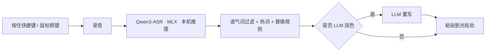

<div align="center">

# Voice Brother

<p align="center">
  
</p>

[](LICENSE)
[]()
[]()
[]()

<br>

**日常说话,松开即成文;整场会议,一键录到底。**

<br>

微信输入法加不了热词,豆包把打字和语音焊在一起,智谱够全但慢。Voice Brother 用本地模型把这些问题一次解决:按住快捷键(键盘修饰键,**或鼠标侧键**)说话,松开就把文字送到光标处。识别在你自己的 Mac 上跑,够快,还能喂进你专业领域的热词和替换规则。它还是个系统级录音器:腾讯会议、微信语音通话等对话音频都能无感录下,自动转成带时间戳的文字纪要,需要时连屏幕画面一并录制。

<br>

[APP 界面](#ui界面) · [为什么自己做](#为什么我要自己制作语音输入法) · [安装](#安装) · [功能](#功能) · [工作原理](#工作原理)

</div>

---

## APP界面

<p align="center">
  
</p>

---

## 为什么我要自己制作语音输入法？

| 输入法 | 加热词 | 实际用起来的槽点 |
| :--- | :---: | :--- |
| 微信输入法 | ❌ | 加不了识别热词,专业术语、生僻词常年识别错 |
| 豆包输入法 | ❌ | 打字和语音两套功能焊死在一起,想切回别的键盘很别扭 |
| 智谱输入法 | ✅ | 能加热词,但识别慢,等得着急 |
| **Voice Brother** | ✅ **有序热词 + 替换规则** | 本地模型、按机器性能选档、独立 App 不抢输入法、鼠标侧键触发 |

它凭什么不一样:

**1. 本地模型,够快**。识别在你自己的 Mac 上跑,音频不上云。可以**按电脑性能选模型档位**:0.6B 已经够准、生成够快,机器强就上 1.7B。

**2. 它不是输入法**。是一个独立 App 配全局快捷键,不接管你的键盘、不占用输入法位,所以**不影响你切换任何其他键盘**。这正是豆包那套混在一起的方案做不到的。

**3. 鼠标侧键就能触发**。触发键支持鼠标上的侧向按键(如 Logitech 后退/前进键),**不必长按键盘**就能开始/结束语音输入。顺手程度是质变,这一点很重要。

**4. 热词 + 替换规则**。把你专业领域的术语、口头常用词、固定写法都喂进去,有序热词增强加上硬替换规则,识别不再丢词、不再写错。

**5. 系统级声音录制**。本地模型不止能做语音输入,它顺手把系统音频也录下来转成文字。腾讯会议、微信语音通话,不切 App、不打断,录完自动出带时间戳的纪要。

---

## 安装

需要 macOS 14+ 和 Xcode 16+。

```bash
git clone https://github.com/Zane456/Voice-Brother.git
cd Voice-Brother
xcodebuild build -project VoiceBrother.xcodeproj -scheme VoiceBrother -quiet
```

首次启动时 Qwen3-ASR 模型会自动下载(0.6B 约 680 MB,1.7B 约 2.5 GB),之后命中本地缓存。引导页会带你完成下面三项 macOS 权限。

| 权限 | 用途 |
| :--- | :--- |
| **辅助功能** | 监听全局快捷键、模拟按键与鼠标点击 |
| **麦克风** | 录音 |
| **屏幕录制** | 采集系统音频(声音录制功能) |

---

## 功能

### 语音输入

| 功能 | 说明 |
| :--- | :--- |
| **按住即录** | 按住触发键(默认右 Option ⌥)录音,松开自动识别并输入;录音中按 ESC 取消 |
| **鼠标侧键触发** | 触发键支持鼠标侧向按键,不必长按键盘,双手不离鼠标也能语音输入 |
| **4 种 ASR 引擎** | 默认 Qwen3-ASR 本地推理(MLX);也可切 Apple 系统语音,或 OpenAI Whisper / 火山引擎云端 |
| **可选模型档位** | 0.6B 求快、1.7B 求准,按你的电脑性能挑 |
| **多语言识别** | 支持中文、英文、日语，可自动检测或手动指定 |
| **热词增强** | 喂入专业术语、常用词,ASR 上下文注入 + LLM 全量辅助,识别更准 |
| **有序替换规则** | 固定的硬替换,把识别结果改写成你要的写法 |
| **自学习纠正** | 在历史记录里手动改一次,自动提取替换规则,下次自动套用 |
| **LLM 润色** | 内置 4 种风格(公众号、小红书、技术写作、正式邮件),留空走默认精修(纠错+断句+删口吃),也可写自定义 prompt |
| **语气词过滤** | 上下文感知地剥掉"嗯、呃、额、对吧、是吧"等口水词,保留语气用法 |
| **句尾标点开关** | 可选保留或去掉识别结果末尾的标点符号 |
| **渐进上屏** | 目标 App 内按打字机节奏逐字键入,而非整段粘贴 |
| **剪贴板保护** | 每次粘贴前后自动保存并恢复剪贴板内容 |

### 声音录制

| 功能 | 说明 |
| :--- | :--- |
| **双 ⌘ 启动** | 同时按住左右 ⌘ 键 0.5 秒即可开始/结束,无需切回 App |
| **系统级录音** | 同时录系统音频与麦克风,Zoom、腾讯会议、微信语音/视频通话,无论用哪个都能录 |
| **自动分段转写** | 录音自动分段并转写,产出带时间戳的 `.md` 纪要 |
| **LLM 会议摘要** | 录音结束后自动用 LLM 整理为对话格式的会议纪要 |
| **独立模型** | 会议转写按 `meetingASRModel` 单独选档,可让语音用 0.6B、会议用 1.7B,两个 Qwen 实例完全独立 |
| **多语言会议** | 会议转写支持中文、英文、日语及自动检测 |
| **可选屏幕录制** | 可同时录 `.mov` 屏幕画面,原画 / 高清两档画质 |
| **重新转写** | 对已完成的录音切换 ASR 模型重跑 |

### LLM 集成:9 家供应商,国内外通吃

| 分类 | 供应商 |
| :--- | :--- |
| **国内** | 智谱 · DeepSeek · 豆包 · Kimi · Z.AI |
| **海外** | OpenAI · Claude (Anthropic) · OpenRouter |
| **本地** | Ollama |

每个供应商都有一键**连接测试**。API Key 存在本地受限文件(`~/Library/Application Support/VoiceBrother/credentials.json`,**0600 权限、仅你自己可读**),不写进 UserDefaults、不进日志,`defaults read` 也读不到。同一套 LLM 层同时服务于语音润色和会议摘要,两者可分别配置。

> 此外还有:菜单栏常驻 + 全局快捷键、实时波形录音浮窗、可搜索的转写历史 + 高频关键词词云 + 使用统计、按功能分别设置自动清理、多套 UI 主题、隐私模式(关闭后不在日志中记录转写内容)。

---

## 工作原理



**1. 捕获**。`CGEventTap` 全局监听触发键(键盘修饰键或鼠标侧键),按下开始录音,松开停止。

**2. 转写**。音频送进运行在 Apple Silicon 上、经 MLX 跑的 Qwen3-ASR 模型。除非你明确选了云端引擎,否则数据不出本机。

**3. 加工**。剥掉语气词,套用热词与你的有序替换规则,并在你开启时由 LLM 把文字重写成指定风格。

**4. 注入**。结果经一次模拟粘贴落到光标处,粘贴前后保存并恢复剪贴板。

会议模式跑的是同一条流水线,但换用第二个更大的模型,经 `ScreenCaptureKit` 采集系统音频,把结果写成带时间戳的 Markdown 而不是输入到光标。

技术栈 **Swift · SwiftUI · MLX · Qwen3-ASR · ScreenCaptureKit · CGEventTap · SQLite**,采用三层架构:共享协议层、语音/会议/基础服务的后端引擎、SwiftUI 前端,让界面与推理后端彻底解耦。

---

## 致谢

Voice Brother 站在 [mlx-swift](https://github.com/ml-explore/mlx-swift)、`speech-swift` MLX 语音库,以及阿里通义 Qwen3-ASR 模型之上。

## 许可证

采用 **PolyForm Noncommercial License 1.0.0**,可免费用于任何**非商业**用途,允许使用、修改、分享。详见 [LICENSE](LICENSE)。

⭐ 如果 Voice Brother 帮你省下了一些打字,欢迎给个 star。

---

<div align="center">

> *「日常说话,松开即成文;整场会议,一键录到底。」*

<br>

**Zane456**,Voice Brother 作者

| 平台 | 链接 |
| :--- | :--- |
| 𝕏 Twitter | [@ZaneZaneZzZZ](https://x.com/ZaneZaneZzZZ) |
| 📕 小红书 | [主页](https://www.xiaohongshu.com/user/profile/Zz302179383) |
| 💻 GitHub | [@Zane456](https://github.com/Zane456) |

<br>

PolyForm Noncommercial License 1.0.0 © [Zane456](https://github.com/Zane456)

</div>
