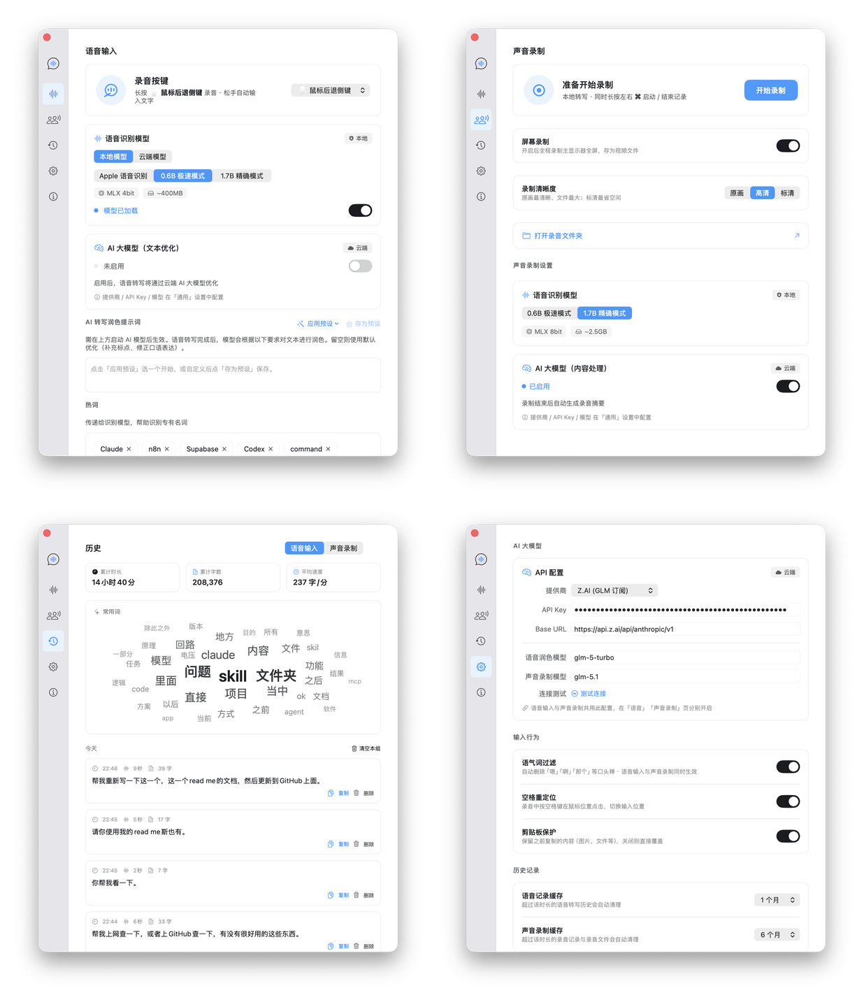

# Voice Brother

<p align="center">
  
</p>

<p align="center">
  <a href="https://x.com/ZaneZaneZzZZ">X / Twitter</a> ·
  <a href="https://www.xiaohongshu.com/user/profile/Zz302179383">小红书</a> ·
  <a href="https://github.com/Zane456">GitHub</a>
</p>

macOS 原生语音输入工具。按住快捷键说话，松开后文字自动输入到光标位置。默认本地推理，也支持云端引擎。

## 功能

### 语音输入

- **按住即录**：按住触发键（默认右 Command）开始录音，松开自动识别并输入文字；按 ESC 随时取消本次录音
- **灵活触发**：除标准修饰键外，支持鼠标侧键（如 Logitech 后退/前进键）作为触发键，游戏/绘图场景更顺手
- **多引擎 ASR**：默认 Qwen3-ASR 本地推理（MLX），也可切换 Apple Speech 或火山引擎云端识别
- **多语言识别**：支持中文、英文、日语，语音输入和会议转写分别可配置语言
- **AI 转写润色**：识别完成后可选 LLM 润色，内置 5 种预设风格（书面化、小红书、公众号、技术写作、正式邮件），也支持自定义 prompt——说口语也能输出成品文字
- **文字后处理**：语气词过滤（嗯、呃、额等）、自定义替换规则、热词增强
- **剪贴板保护**：粘贴前后自动保存和恢复剪贴板内容
- **空格重定位**：录音中按空格可在鼠标处点击，切换输入位置

### 会议纪要

- **快速启动**：同时按住左右 Command 键 0.5 秒即可开始/结束会议录制，无需切回 App
- 同时录制系统音频和麦克风，自动分段转写
- 输出带时间戳的 Markdown 文件
- **独立 ASR 模型**：语音输入用 0.6B 追求快响应，会议转写用 1.7B 追求高精度，互不干扰
- 可选屏幕录制（.mov，含混合音频），支持原画 / HD / SD 三档画质
- 支持切换不同 ASR 模型重新转写

### LLM 集成

内置 9+ 主流 LLM 供应商，国内外通吃：

| 分类 | 供应商 | 默认模型 |
|------|--------|---------|
| 海外 | OpenAI | gpt-4o-mini |
| 海外 | Claude (Anthropic) | claude-sonnet-4-6 |
| 海外 | OpenRouter | gemini-2.0-flash |
| 国内 | 智谱 | glm-4-flash |
| 国内 | DeepSeek | deepseek-chat |
| 国内 | 豆包 (字节跳动) | doubao-1-5-pro-32k |
| 国内 | Kimi (月之暗面) | moonshot-v1-8k |
| 国内 | Z.AI (智谱订阅) | glm-5-turbo |
| 本地 | Ollama | qwen2.5:7b |

- LLM 同时服务于**语音润色**和**会议摘要**，可分别配置不同供应商和模型
- 每个供应商提供**连接测试**按钮，填入 API Key 后一键验证连通性
- 所有 API Key 均安全存储于系统 **Keychain**

### 其他

- Glassmorphism 毛玻璃 UI 风格
- 菜单栏常驻，全局快捷键
- 录音浮窗实时波形动画
- 转写历史记录，关键词分析；语音与会议可分别配置自动清理月数
- 引导式权限配置（辅助功能、麦克风、屏幕录制）
- About 页数据流向透明视图，本地处理与云端调用一目了然

## 技术栈

- **Swift / SwiftUI** — macOS 14+ 原生应用
- **MLX** — Apple Silicon 上的机器学习推理框架
- **Qwen3-ASR** — 阿里通义语音识别模型（0.6B / 1.7B）
- **speech-swift** — MLX 语音推理封装
- **ScreenCaptureKit** — 系统音频采集
- **CGEventTap** — 全局键盘/鼠标事件监听与模拟
- **SQLite** — 历史记录持久化

## 架构

```
VoiceBrother/
├── VoiceBrotherApp.swift              # App 入口
├── Backend/
│   ├── Voice/                         # 语音输入引擎
│   │   ├── VoiceService.swift         # 核心录音→识别→输入流程
│   │   ├── QwenASREngine.swift        # Qwen3-ASR (MLX)
│   │   ├── AppleASREngine.swift       # Apple Speech
│   │   ├── VolcanoASREngine.swift     # 火山引擎 Seed ASR 2.0
│   │   ├── KeyboardListener.swift     # 全局键盘事件
│   │   ├── TextInjector.swift         # 剪贴板→模拟粘贴
│   │   ├── TextProcessor.swift        # 语气词过滤 + 替换规则
│   │   ├── FillerRemover.swift        # 语气词清理
│   │   ├── ITNProcessor.swift         # 逆文本正则化（数字、标点）
│   │   ├── LLMClient.swift            # LLM 文本润色（OpenAI 兼容 / Claude）
│   │   ├── FocusObserver.swift        # 前台应用焦点监听
│   │   └── MLXMemoryGovernor.swift    # MLX 内存治理
│   ├── Meeting/                       # 会议纪要
│   │   ├── MeetingService.swift       # 会议全流程管理
│   │   ├── MeetingSummarizer.swift    # LLM 摘要生成
│   │   ├── MeetingScreenRecorder.swift # 屏幕录制
│   │   ├── MeetingRetranscriber.swift  # 重新转写
│   │   └── MeetingRetranscribeLauncher.swift
│   └── Services/                      # 基础服务
│       ├── ConfigManager.swift        # 配置持久化
│       ├── HistoryManager.swift       # 历史记录 (SQLite)
│       ├── PermissionManager.swift    # 权限管理
│       ├── KeywordAnalyzer.swift      # 关键词分析
│       └── KeychainStore.swift        # 密钥安全存储
├── Frontend/
│   ├── MainWindow.swift               # 主窗口（两栏布局）
│   ├── MenuBarController.swift        # 菜单栏控制
│   ├── OnboardingView.swift           # 引导页
│   ├── Components/                    # UI 组件
│   │   ├── RecordingOverlayPanel.swift # 录音浮窗
│   │   ├── RecordingWaveformView.swift # 波形动画
│   │   ├── AppLogoView.swift
│   │   ├── BrandGlyphs.swift
│   │   ├── CodexBadge.swift / CodexButtonStyles.swift
│   │   ├── ColorExtension.swift       # 自定义色板
│   │   ├── CustomToggleStyle.swift
│   │   ├── FlowLayout.swift / WordCloudView.swift
│   │   ├── LLMConfigCard.swift
│   │   ├── MonoTextExtension.swift
│   │   ├── SectionHeader.swift / Spacing.swift
│   │   ├── StatusBarIcon.swift
│   │   └── VisualEffectView.swift / WindowCornerRadius.swift
│   └── Tabs/                          # 设置页面
│       ├── SettingsTab.swift          # 通用设置
│       ├── VoiceTab.swift             # 语音设置
│       ├── HistoryTab.swift           # 历史记录
│       ├── MeetingTab.swift           # 会议设置
│       ├── AboutTab.swift             # 关于
│       └── Sections/                  # 设置子模块
│           ├── GeneralSettingsSection.swift
│           ├── VoiceSettingsSection.swift
│           ├── MeetingSettingsSection.swift
│           └── PermissionWarningSection.swift
└── Shared/
    ├── Protocols.swift                # 前后端协议定义
    ├── Types.swift                    # 共享类型（枚举、模型）
    ├── AppConfig.swift                # 配置模型
    ├── ThemeManager.swift             # 主题管理
    └── DebugLog.swift                 # 日志工具
```

## 构建

需要 macOS 14+ 和 Xcode 15+。

```bash
# 克隆仓库
git clone https://github.com/Zane456/Voice-Brother.git
cd Voice-Brother

# 构建
xcodebuild build -project VoiceBrother.xcodeproj -scheme VoiceBrother -quiet

# 或直接用 Xcode 打开
open VoiceBrother.xcodeproj
```

首次启动时 Qwen3-ASR 模型会自动下载（0.6B 约 680MB，1.7B 约 2.5GB），之后命中本地缓存。

## 权限

Voice Brother 需要以下 macOS 权限：

| 权限 | 用途 |
|------|------|
| 辅助功能 (Accessibility) | 监听全局键盘事件、模拟按键和鼠标点击 |
| 麦克风 (Microphone) | 录音 |
| 屏幕录制 (Screen Recording) | 采集系统音频（会议纪要功能） |

首次启动会有引导页面帮助配置。

## 致谢

- [mlx-swift](https://github.com/ml-explore/mlx-swift) — Apple MLX 的 Swift 绑定
- [speech-swift](https://github.com/anthropics/speech-swift) — 基于 MLX 的语音识别库
- [swift-huggingface](https://github.com/huggingface/swift-huggingface) — HuggingFace 模型下载

## License

本项目采用 **[PolyForm Noncommercial License 1.0.0](LICENSE)** —— Source-Available（源码可见）协议。

你**可以**：查看源码、修改、用于学习/研究/个人项目、基于本项目二次创作并分发。
你**不可以**：将本项目或其衍生作品用于任何商业用途。商业授权请联系作者：[zz302179383@gmail.com](mailto:zz302179383@gmail.com)。

任何分发或衍生作品**必须保留**以下署名（来自 LICENSE 文件的 `Required Notice`）：

> Required Notice: Copyright (c) 2026 Zane456 — Voice Brother (https://github.com/Zane456/Voice-Bubble)
